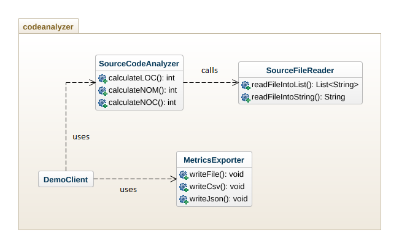

# Code Analyzer
The third assignment evaluates the modification of a given code-base in order to improve the quality of the system using design patterns.

The given code-base is a software system that reads a Java source code file that is stored locally or on the web, calculate the LOC, NOM and NOC metrics and finally exports these metrics to an output file.

## Code-Base's Class Diagram


## Modified System's Class Diagram


## Design Patterns

### Facade
Facade design pattern serves as a front-facing interface masking more complex underlying or structural code. In this case, it provides Client with simplified access to the actual functionality of the system.

#### Benefits
* Provides a simple interface to a complex system
* Promotes subsystem independence and portability
* Defines an entry point to each subsystem level
* Dependences between subsystems are simplified by making them communicate with each other solely through the facade.

#### Classes
[Client](./src/main/java/client/Client.java) - uses Facade to access the functionality of the main system

[CodeAnalyzer](./src/main/java/codeanalyzer/CodeAnalyzer.java) - analyzes the contents of a Java source code file, calculates the metrics and exports a file containing them

### Factory
Factory design pattern serves as a common interface to refer to all objects of the same kind. Objects are created without exposing the instantiation logic to the class calling the Factory.

#### Benefits
* Separates the logic to instantiate classes
* Supports extending each hierarchy without affecting the class calling each Factory

#### Classes
[CodeAnalyzer](./src/main/java/codeanalyzer/CodeAnalyzer.java) - calls each Factory in order to read and analyze the given code file as well as to extract its metrics

[InputFileFactory](./src/main/java/inputreader/InputFileFactory.java) - retrieves content of input file based on its location type

[MetricsFactory](./src/main/java/metricsmanager/MetricsFactory.java) - calculates metrics based on source code analyzer type

[OutputFileFactory](./src/main/java/outputexporter/OutputFileFactory.java) - chooses export type for output file

## Getting Started
1. Fork this repository to your GitHub account.
2. Clone the forked repository to your local machine using ```git clone link-of-forked-repository```.
3. Create a new working branch with ```git branch new-branch```.
4. Change to your new branch with ```git checkout new-branch```.

Make sure [JUnit](https://mvnrepository.com/artifact/junit/junit) is included in parent pom.xml as a dependency.
```
<dependency>
    <groupId>junit</groupId>
    <artifactId>junit</artifactId>
    <version>4.12</version>
    <scope>test</scope>
</dependency>
```

Make sure [Mockito](https://mvnrepository.com/artifact/org.mockito/mockito-core/) is included in parent pom.xml as a dependency.
```
<dependency>
    <groupId>org.mockito</groupId>
    <artifactId>mockito-core</artifactId>
    <version>2.27.0</version>
    <scope>test</scope>
</dependency>
```

This module requires one runtime dependency which is packaged in the main jar (fat-jar). To create a fat-jar you need to use the ```maven-assembly-plugin``` plugin and also define the class that is the main entry point of the system (the class that contains the main method). 
```
<plugin>
	<artifactId>maven-assembly-plugin</artifactId>
	<configuration>
		<archive>
			<manifest>
			  <mainClass>client.Client</mainClass> 
			</manifest>
		</archive>
		<descriptorRefs>
			<descriptorRef>jar-with-dependencies</descriptorRef>
		</descriptorRefs>
	</configuration>
	<executions>
		<execution>
			<id>make-assembly</id>
			<phase>package</phase>
			<goals>
				<goal>single</goal>
			</goals>
		</execution>
	</executions>
</plugin>
```

The produced jar is located in the target directory and can be executed as following:
```
java -jar codeanalyzer/target/codeanalyzer-0.0.1-SNAPSHOT-jar-with-dependencies.jar arg0 arg1 arg2 arg3 arg4
```
```arg0 = "JavaSourceCodeInputFile"``` e.g. src/test/resources/TestClass.java

```arg1 = "SourceCodeAnalyzerType``` [regex|strcomp]

```arg2 = "SourceCodeLocationType"``` [local|web]

```arg3 = "OutputFilePath"``` e.g. ../output_metrics_file

```arg4 = "OutputFileType"``` [csv|json]

For example, when inside codeanalyzer folder, run ```java –jar ./target/codeanalyzer-0.0.1-SNAPSHOT-jar-with-dependencies.jar ./src/test/resources/TestClass.java regex local metrics_results csv```

Note that the codeanalyzer-0.0.1-SNAPSHOT.jar is not executable.

## Build
Execute the following command in the repository root directory in order to build the project.
```
mvn clean package jacoco:report
```
This command generates a seperate jar file in module's corresponding target (```module/target```) directory and also a report of the code coverage produced by JaCoCo. The report will be located in the following path for each module: ```target/site/jacoco```

## Test
To simply run the unit tests of the project, execute the following command:
```
mvn test
```
Note that only classes with a ```Test``` suffix located in the ```src/test``` will be executed and reported as tests.
You can also run each test independently using Eclipse by right-clicking on the preferred test and choose Run as -> Junit Test.

## Generate Test-Coverage Report
To run the unit tests of the project and generate a report of the code coverage produced by JaCoCo, execute the following command:
```
mvn test jacoco:report
```
The report will be located in the following path: ```target/site/jacoco```

## Authors
[Irene Arapogiorgi](https://gr.linkedin.com/in/irene-arapogiorgi)

## Acknowledgments
[Antonis Gkortzis](https://github.com/AntonisGkortzis) for the assignment template and instructions.