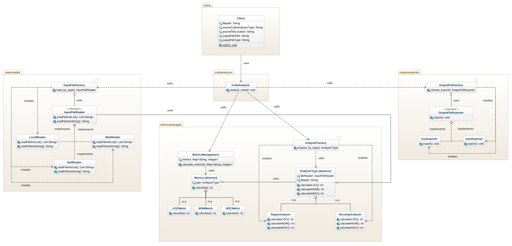

# Code Analyzer
The third assignment evaluates the modification of a given code-base in order to improve the quality of the system using design patterns.

The given code-base is a software system that reads a Java source code file that is stored locally or on the web, calculate the LOC, NOM and NOC metrics and finally exports these metrics to an output file.

## Getting Started
1. Fork this repository to your GitHub account.
2. Clone the forked repository to your local machine using ```git clone link-of-forked-repository```.
3. Create a new working branch with ```git branch new-branch```.
4. Change to your new branch with ```git checkout new-branch```.

Make sure [JUnit](https://mvnrepository.com/artifact/junit/junit) is included in parent pom.xml as a dependency.
```
<dependency>
    <groupId>junit</groupId>
    <artifactId>junit</artifactId>
    <version>4.12</version>
    <scope>test</scope>
</dependency>
```

Make sure [Mockito](https://mvnrepository.com/artifact/org.mockito/mockito-core/) is included in parent pom.xml as a dependency.
```
<dependency>
    <groupId>org.mockito</groupId>
    <artifactId>mockito-core</artifactId>
    <version>2.27.0</version>
    <scope>test</scope>
</dependency>
```

This module requires one runtime dependency which is packaged in the main jar (fat-jar). To create a fat-jar you need to use the ```maven-assembly-plugin``` plugin and also define the class that is the main entry point of the system (the class that contains the main method). 
```
<plugin>
	<artifactId>maven-assembly-plugin</artifactId>
	<configuration>
		<archive>
			<manifest>
			  <mainClass>client.Client</mainClass> 
			</manifest>
		</archive>
		<descriptorRefs>
			<descriptorRef>jar-with-dependencies</descriptorRef>
		</descriptorRefs>
	</configuration>
	<executions>
		<execution>
			<id>make-assembly</id>
			<phase>package</phase>
			<goals>
				<goal>single</goal>
			</goals>
		</execution>
	</executions>
</plugin>
```

The produced jar is located in the target directory and can be executed as following:
```
java -jar codeanalyzer/target/codeanalyzer-0.0.1-SNAPSHOT-jar-with-dependencies.jar arg0 arg1 arg2 arg3 arg4
```
```arg0 = "JavaSourceCodeInputFile"``` e.g. src/test/resources/TestClass.java

```arg1 = "SourceCodeAnalyzerType``` [regex|strcomp]

```arg2 = "SourceCodeLocationType"``` [local|web]

```arg3 = "OutputFilePath"``` e.g. ../output_metrics_file

```arg4 = "OutputFileType"``` [csv|json]

For example, when inside codeanalyzer folder, run ```java –jar ./target/codeanalyzer-0.0.1-SNAPSHOT-jar-with-dependencies.jar ./src/test/resources/TestClass.java regex local metrics_results csv```

Note that the codeanalyzer-0.0.1-SNAPSHOT.jar is not executable.

## Build
Execute the following command in the repository root directory in order to build the project.
```
mvn clean package jacoco:report
```
This command generates a seperate jar file in module's corresponding target (```module/target```) directory and also a report of the code coverage produced by JaCoCo. The report will be located in the following path for each module: ```target/site/jacoco```

## Test
To simply run the unit tests of the project, execute the following command:
```
mvn test
```
Note that only classes with a ```Test``` suffix located in the ```src/test``` will be executed and reported as tests.
You can also run each test independently using Eclipse by right-clicking on the preferred test and choose Run as -> Junit Test.

## Generate Test-Coverage Report
To run the unit tests of the project and generate a report of the code coverage produced by JaCoCo, execute the following command:
```
mvn test jacoco:report
```
The report will be located in the following path: ```target/site/jacoco```

## Code-Base's Class Diagram


## Modified System's Class Diagram


## Design Patterns

### <a name="menu"></a>Design Patterns Menu
* [Facade](#facade)
* [Factory](#factory)
* [Strategy](#strategy)
* [Bridge](#bridge)
* [Null Object](#null)

### <a name="facade"></a>Facade
Facade design pattern serves as a front-facing interface masking more complex underlying or structural code. In this case, it provides Client with simplified access to the actual functionality of the system.

#### Benefits
* Provides a simple interface to a complex system
* Promotes subsystem independence and portability
* Defines an entry point to each subsystem level
* Dependences between subsystems are simplified by making them communicate with each other solely through the facade.

#### Trade-offs
* There is high complexity and difficulty to test Facade as a pattern

#### Classes
[Client](./src/main/java/client/Client.java) - uses Facade to access the functionality of the main system

[CodeAnalyzer](./src/main/java/codeanalyzer/CodeAnalyzer.java) - analyzes the contents of a Java source code file, calculates the metrics and exports a file containing them

CodeAnalyzer interacts directly with classes [InputFileFactory](./src/main/java/inputreader/InputFileFactory.java), [MetricsFactory](./src/main/java/metricsmanager/MetricsFactory.java), [MetricsManagement](./src/main/java/metricsmanager/MetricsManagement.java) and [OutputFileFactory](./src/main/java/outputexporter/OutputFileFactory.java).

### <a name="factory"></a>Factory
Factory design pattern serves as a common interface to refer to all objects of the same kind. Objects are created without exposing the instantiation logic to the class calling the Factory.

#### Benefits
* Separates the logic to instantiate classes
* Supports extending each hierarchy without affecting the class calling each Factory

#### Classes
[CodeAnalyzer](./src/main/java/codeanalyzer/CodeAnalyzer.java) - calls each Factory in order to read and analyze the given code file as well as to extract its metrics

[InputFileFactory](./src/main/java/inputreader/InputFileFactory.java) - retrieves content of input file based on its location type

InputFileFactory creates objects of classes [LocalReader](./src/main/java/inputreader/LocalReader.java), [WebReader](./src/main/java/inputreader/WebReader.java) and [NullReader](./src/main/java/inputreader/NullReader.java) with [InputFileReader](./src/main/java/inputreader/InputFileReader.java) being their interface.

[AnalyzerFactory](./src/main/java/metricsmanager/AnalyzerFactory.java) - calculates metrics based on source code analyzer type

AnalyzerFactory creates objects of classes [RegexAnalyzer](./src/main/java/metricsmanager/RegexAnalyzer.java) and [StrcompAnalyzer](./src/main/java/metricsmanager/StrcompAnalyzer.java) with [AnalyzerType](./src/main/java/metricsmanager/AnalyzerType.java) being their interface.

[OutputFileFactory](./src/main/java/outputexporter/OutputFileFactory.java) - chooses export type for output file

OutputFileFactory creates objects of classes [CsvExporter](./src/main/java/outputexporter/CsvExporter.java) and [JsonExporter](./src/main/java/outputexporter/JsonExporter.java) with [OutputFileExporter](./src/main/java/outputexporter/OutputFileExporter.java) being their interface.

### <a name="strategy"></a>Strategy
Strategy design pattern defines a family of algorithms/functionalities, encapsulates each one, and makes them interchangeable. Strategy lets the algorithm vary independently from the class using it.

#### Benefits
* Reduces overall complexity as it separates possible functionalities from Client and Factories
* Supports possible changes or integrations of functionalities with the least possible code modification

#### Trade-offs
* Factories are coupled to input reader, metrics manager and output exporter implementation

#### Classes

Family of [InputFileReader](./src/main/java/inputreader/InputFileReader.java) interface (classes read input file based on its location type): [LocalReader](./src/main/java/inputreader/LocalReader.java), [WebReader](./src/main/java/inputreader/WebReader.java) and [NullReader](./src/main/java/inputreader/NullReader.java).

Family of [Metrics](./src/main/java/metricsmanager/Metrics.java) abstract class (classes correspond to different metrics): [LOCMetric](./src/main/java/metricsmanager/LOCMetric.java), [NOMMetric](./src/main/java/metricsmanager/NOMMetric.java) and [NOCMetric](./src/main/java/metricsmanager/NOCMetric.java).

Family of [AnalyzerType](./src/main/java/metricsmanager/AnalyzerType.java) abstract class (classes analyze metrics based on analyzer type): [RegexAnalyzer](./src/main/java/metricsmanager/RegexAnalyzer.java) and [StrcompAnalyzer](./src/main/java/metricsmanager/StrcompAnalyzer.java).

Family of [OutputFileExporter](./src/main/java/outputexporter/OutputFileExporter.java) interface (classes export output file based on file type): [CsvExporter](./src/main/java/outputexporter/CsvExporter.java) and [JsonExporter](./src/main/java/outputexporter/JsonExporter.java).

### <a name="bridge"></a>Bridge
Bridge design pattern decouples an abstraction from its implementation so that the two can vary independently. It is useful when both the class and what it does vary often. The class itself can be thought of as the abstraction and what the class can do as the implementation. The bridge pattern can also be thought of as two layers of abstraction.

#### Benefits
* Dimensions Metrics and Analyzers can vary independently
* Adding new types of Analyzers does not affect the Metrics hierarchy
* Adding new Metrics require minimal changes in the Analyzers hierarchy (just the addition of corresponding methods)
* Analyzing by type functionality moved to a more appropriate class

#### Classes
First Bridge implementation between **Metrics** and **Analyzers**:

[MetricsManagement](./src/main/java/metricsmanager/MetricsManagement.java) - manages Metrics objects in order to calculate input file's metrics

[Metrics](./src/main/java/metricsmanager/Metrics.java) - abstract class

[LOCMetric](./src/main/java/metricsmanager/LOCMetric.java), [NOMMetric](./src/main/java/metricsmanager/NOMMetric.java) and [NOCMetric](./src/main/java/metricsmanager/NOCMetric.java) - different types of metrics (refined abstraction)

[AnalyzerFactory](./src/main/java/metricsmanager/AnalyzerFactory.java) - calculates metrics based on source code analyzer type

[AnalyzerType](./src/main/java/metricsmanager/AnalyzerType.java) - abstract class

[RegexAnalyzer](./src/main/java/metricsmanager/RegexAnalyzer.java) and [StrcompAnalyzer](./src/main/java/metricsmanager/StrcompAnalyzer.java) - different types of analyzer types (refined abstraction)

Second Bridge implementation between **Input File Readers** and **Analyzers**:

[InputFileFactory](./src/main/java/inputreader/InputFileFactory.java) - retrieves content of input file based on its location type

[InputFileReader](./src/main/java/inputreader/InputFileReader.java) - interface class

[LocalReader](./src/main/java/inputreader/LocalReader.java), [WebReader](./src/main/java/inputreader/WebReader.java) and [NullReader](./src/main/java/inputreader/NullReader.java) - different types of file locations

[AnalyzerFactory](./src/main/java/metricsmanager/AnalyzerFactory.java) - calculates metrics based on source code analyzer type

[AnalyzerType](./src/main/java/metricsmanager/AnalyzerType.java) - abstract class

[RegexAnalyzer](./src/main/java/metricsmanager/RegexAnalyzer.java) and [StrcompAnalyzer](./src/main/java/metricsmanager/StrcompAnalyzer.java) - different types of analyzer types (refined abstraction)

### <a name="null"></a>Null Object
Null Object design pattern simplifies the use of dependencies that can be undefined by using instances of a concrete class that implements a known interface instead of null references.

#### Benefits
* Removes the responsibility of classes handling null cases
* Simplifies code as it avoids having to write testing code which handles the null collaborator specially

#### Trade-offs
* It might cause more harm than good by hiding errors and complicating testing

#### Classes
[NullReader](./src/main/java/inputreader/NullReader.java) - manages null output if source file's type is neither of the known types (local, web)

[InputFileReader](./src/main/java/inputreader/InputFileReader.java) - interface of NullReader class

## Authors
[Irene Arapogiorgi](https://gr.linkedin.com/in/irene-arapogiorgi)

## Acknowledgments
[Antonis Gkortzis](https://github.com/AntonisGkortzis) for the assignment template and instructions.